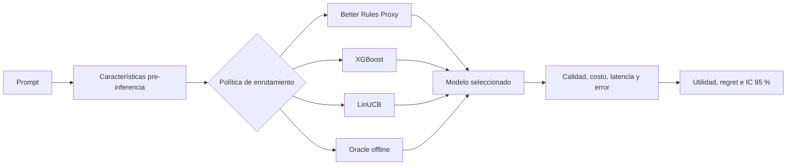
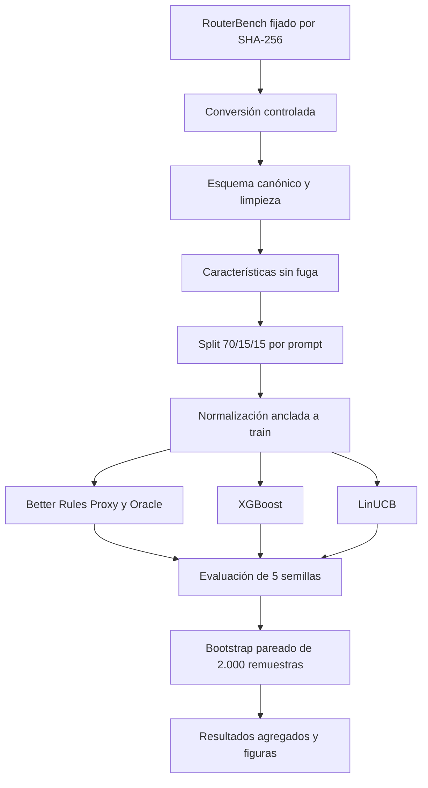

# Better Router Adaptive Research

[](https://github.com/FitoFritzG/better-router-adaptive-research/actions/workflows/ci.yml)
[](pyproject.toml)
[](LICENSE)
[](ENTREGA.md)

Investigación reproducible sobre **enrutamiento adaptativo de modelos de lenguaje**. El proyecto estudia si una política aprendida puede seleccionar, para cada consulta, el modelo que maximiza una utilidad conjunta de calidad, costo, latencia y confiabilidad.

## Integrantes

- **Rodolfo Fritz**
- **Benjamín Cerda**
- **Felipe Friz**

Universidad del Bío-Bío — Ingeniería Civil en Automatización.

## Estado de la entrega

La **entrega obligatoria está cerrada y lista para evaluación técnica**.

- Guía del profesor: [`EVALUACION_PROFESOR.md`](EVALUACION_PROFESOR.md).
- Resumen de entrega: [`ENTREGA.md`](ENTREGA.md).
- Código fuente: [`src/better_router_adaptive/`](src/better_router_adaptive/).
- Pruebas: [`tests/`](tests/).
- Resultados agregados: [`artifacts/public/step7-real/`](artifacts/public/step7-real/).
- Metodología y análisis: [`docs/`](docs/).
- Póster científico: se entrega como archivo PDF separado.

El bonus se desarrollará posteriormente en una rama nueva y no altera esta versión evaluable.

## Problema de ingeniería

Un router multi-LLM debe decidir qué modelo utilizar antes de conocer la respuesta. Elegir siempre el modelo más potente aumenta el costo; elegir siempre el más económico puede reducir la calidad. El problema consiste en seleccionar un modelo por consulta considerando simultáneamente:

- calidad;
- costo;
- latencia;
- errores o fallos;
- características observables antes de ejecutar el modelo.

Pregunta de investigación:

> ¿Las políticas de enrutamiento aprendidas logran una utilidad esperada superior a una política ponderada determinista al seleccionar entre modelos heterogéneos?

## Algoritmos obligatorios

| Estrategia | Función en el estudio |
|---|---|
| **XGBoost** | Regresión supervisada de utilidad, con un modelo por brazo |
| **LinUCB** | Bandit contextual disjunto con evaluación prequential |
| Better Rules Proxy | Línea base determinista |
| Brazos fijos | Referencias que siempre seleccionan el mismo modelo |
| Oracle offline | Cota superior no desplegable |

`EvoCascade-Ideal` permanece versionado como estudio exploratorio adicional. No es necesario para evaluar el cumplimiento obligatorio y usa un verificador ideal simulado, por lo que no representa rendimiento directamente desplegable.

## Arquitectura



## Pipeline reproducible



## Procesamiento de datos

El pipeline implementa:

1. descarga desde la fuente oficial;
2. verificación de tamaño, revisión y SHA-256;
3. conversión de `pickle` a CSV no ejecutable;
4. validación de esquema;
5. eliminación de duplicados exactos;
6. rechazo de duplicados contradictorios;
7. filtrado de valores inválidos;
8. conservación de prompts con cuatro brazos completos;
9. creación de características pre-inferencia;
10. división agrupada por `prompt_id` para evitar fuga de información.

El dataset original y las tablas procesadas fila por fila no se redistribuyen porque la tarjeta de RouterBench no declara una licencia explícita para esos datos. El repositorio publica scripts, checksums, configuraciones, resultados agregados y figuras.

## Función de utilidad

La evaluación utiliza:

$$
U = 0.65Q - 0.20C_n - 0.10L_n - 0.05E
$$

- `Q`: calidad normalizada.
- `C_n`: costo normalizado con estadísticas calculadas solo en entrenamiento.
- `L_n`: latencia normalizada.
- `E`: indicador de error.

RouterBench no aporta latencia en el artefacto real utilizado. En esa ejecución el término de latencia queda deshabilitado y los pesos restantes no se renormalizan.

## Resultados principales

El experimento utiliza **36.497 prompts**, cuatro modelos, cinco semillas y bootstrap pareado por `prompt_id`.

| Política | Utilidad media | Diferencia vs. baseline | IC 95 % de la diferencia |
|---|---:|---:|---:|
| Oracle offline | 0,564086 | +0,068004 | [0,065643; 0,070490] |
| XGBoost | 0,496082 | ≈ 0 | [-0,000548; 0,000576] |
| Better Rules Proxy | 0,496082 | 0 | [0; 0] |
| LinUCB | 0,495940 | -0,000142 | [-0,000475; 0,000189] |

Conclusión:

> Con las características pre-inferencia actuales, XGBoost y LinUCB no superan de manera estadísticamente significativa a Better Rules Proxy. El Oracle offline demuestra que existe margen real para mejorar el enrutamiento por consulta, pero las señales utilizadas todavía no permiten capturarlo.

Este es un resultado válido: permite identificar limitaciones del espacio de características y fundamentar mejoras futuras.

### Figuras


## Instalación

```bash
git clone https://github.com/FitoFritzG/better-router-adaptive-research.git
cd better-router-adaptive-research
python -m venv .venv
```

Linux/macOS:

```bash
source .venv/bin/activate
python -m pip install --upgrade pip
python -m pip install -e ".[dev]"
```

Windows PowerShell:

```powershell
.venv\Scripts\Activate.ps1
python -m pip install --upgrade pip
python -m pip install -e ".[dev]"
```

## Evaluación rápida

```bash
python scripts/verify_professor_submission.py
python -m pytest -q
```

## Evaluación completa

Linux/macOS con `make`:

```bash
make professor-check
```

Comandos equivalentes en cualquier sistema:

```bash
python -m pytest -q \
  --cov=better_router_adaptive \
  --cov-branch \
  --cov-report=term-missing \
  --cov-fail-under=85
ruff check .
ruff format --check .
mypy src tests
python -m build
python scripts/verify_professor_submission.py
```

La CI ejecuta pruebas, cobertura, lint, formato, tipado estricto, build y smoke tests en Python 3.12 y 3.13.

## Interfaces de ejecución

```bash
python -m better_router_adaptive.data.download --help
python -m better_router_adaptive.data.convert --help
python -m better_router_adaptive.data.pipeline --help
python -m better_router_adaptive.prepare --help
python -m better_router_adaptive.baselines --help
python -m better_router_adaptive.learn --help
python -m better_router_adaptive.evaluate --help
```

## Documentación

- [Guía de evaluación](EVALUACION_PROFESOR.md)
- [Entrega académica](ENTREGA.md)
- [Reproducibilidad](docs/REPRODUCIBILITY.md)
- [Metodología](docs/METHODOLOGY.md)
- [Diccionario de datos](docs/DATA_DICTIONARY.md)
- [Características y particiones](docs/STEP_4_FEATURES_SPLITS.md)
- [Utilidad y baselines](docs/STEP_5_UTILITY_BASELINES.md)
- [Routers aprendidos](docs/STEP_6_LEARNED_ROUTERS.md)
- [Evaluación final](docs/STEP_7_EVALUATION.md)
- [Resultados y limitaciones](docs/RESULTS.md)

## Licencias y privacidad

El código propio se publica bajo licencia MIT. Los datasets y benchmarks de terceros conservan sus términos. El repositorio no incluye prompts de producción, API keys, usuarios, credenciales ni datos privados de Better Router.
