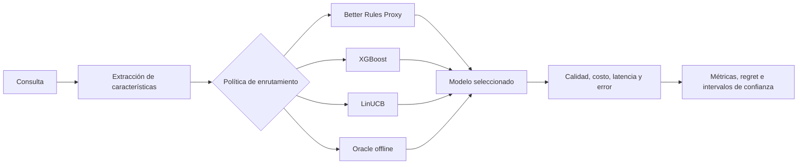
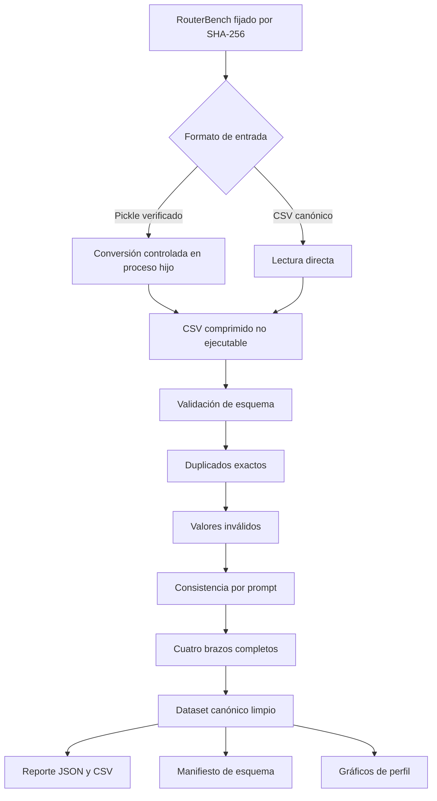
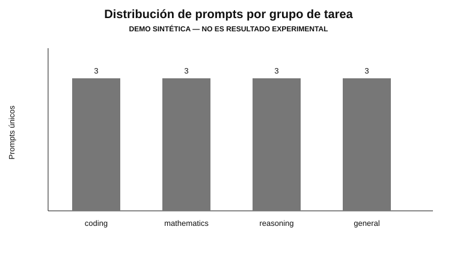
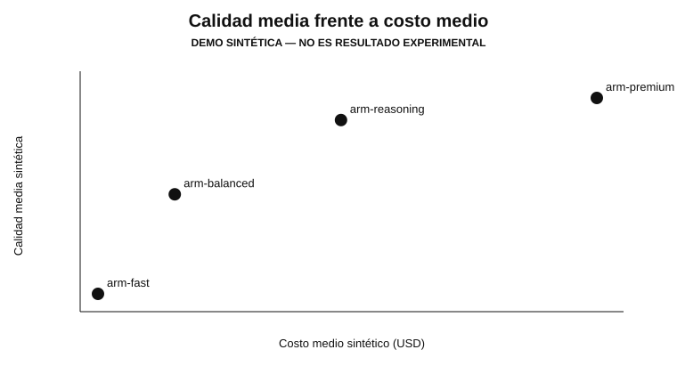
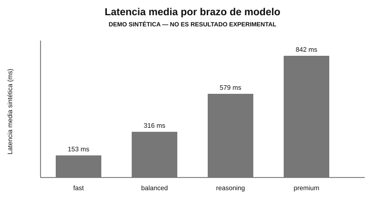

# Better Router Adaptive Research

[](https://github.com/FitoFritzG/better-router-adaptive-research/actions/workflows/ci.yml)
[](pyproject.toml)
[](LICENSE)
[](#estado-del-proyecto)

**Better Router Adaptive** es una investigación reproducible sobre enrutamiento inteligente de modelos de lenguaje. El objetivo es determinar si una política aprendida puede seleccionar, para cada consulta, el modelo que ofrece el mejor equilibrio entre **calidad, costo, latencia y confiabilidad**.

> **Estado científico:** todavía no se presentan conclusiones empíricas sobre XGBoost o LinUCB. Los gráficos visibles en este README utilizan un fixture sintético y están rotulados como demostración, no como resultados del experimento final.

## Resumen ejecutivo

El estudio compara cuatro estrategias:

| Estrategia | Función en el estudio |
|---|---|
| Better Rules Proxy | Línea base determinista inspirada en Better Router |
| XGBoost | Predictor supervisado de utilidad por modelo |
| LinUCB | Bandit contextual con exploración y explotación |
| Oracle offline | Cota superior que conoce la mejor decisión observada |

La función objetivo principal es:

$$
U = 0.65Q - 0.20C_n - 0.10L_n - 0.05E
$$

- \(Q\): calidad normalizada.
- \(C_n\): costo normalizado.
- \(L_n\): latencia normalizada.
- \(E\): indicador de error.

## Pregunta de investigación

> ¿Las políticas de enrutamiento aprendidas logran una utilidad esperada superior a una política ponderada determinista al seleccionar entre modelos heterogéneos?

## Arquitectura investigativa



## Pipeline de datos — Paso 3



### Contrato canónico

Cada fila representa un resultado para la clave primaria `(prompt_id, model_id)`:

| Campo | Significado | Regla principal |
|---|---|---|
| `prompt_id` | Identificador estable de la consulta | No nulo |
| `prompt_text` | Texto o representación de la consulta | No vacío |
| `dataset` | Benchmark de origen | No vacío |
| `task_group` | `coding`, `mathematics`, `reasoning` o `general` | Categoría controlada |
| `model_id` | Brazo candidato | Único por prompt |
| `quality` | Calidad normalizada | Intervalo `[0, 1]` |
| `input_tokens` | Tokens de entrada | Entero no negativo o nulo |
| `output_tokens` | Tokens de salida | Entero no negativo o nulo |
| `cost_usd` | Costo de la inferencia | No negativo o nulo |
| `latency_ms` | Latencia | No negativa o nula |
| `success` | Ejecución válida | Booleano |
| `data_origin` | Procedencia del registro | No vacío |

El diccionario completo está en [`docs/DATA_DICTIONARY.md`](docs/DATA_DICTIONARY.md).

## Perfil visual del fixture de pruebas

Estas figuras comprueban que el pipeline genera documentación automáticamente. **No son evidencia experimental.**

### Distribución de tareas



### Relación calidad-costo



### Latencia por brazo



## Seguridad de la conversión

El archivo oficial seleccionado por RouterBench es un pickle. Un pickle puede ejecutar código durante su carga, por lo que el proyecto aplica estas barreras:

1. exige el SHA-256 fijado antes de abrir el archivo;
2. no hereda variables de entorno sensibles;
3. ejecuta la carga en un proceso hijo sin `shell`;
4. publica el CSV solamente después de terminar la conversión;
5. reemplaza el destino de forma atómica;
6. elimina las respuestas textuales de los modelos del esquema canónico;
7. documenta explícitamente que el proceso hijo **no constituye un sandbox de seguridad**.

La conversión real debe ejecutarse en una máquina o contenedor desechable sin credenciales ni acceso a producción.

## Instalación

```bash
python -m venv .venv
```

Linux/macOS:

```bash
source .venv/bin/activate
python -m pip install --upgrade pip
python -m pip install -e ".[dev]"
```

Windows PowerShell:

```powershell
.venv\Scripts\Activate.ps1
python -m pip install --upgrade pip
python -m pip install -e ".[dev]"
```

## Reproducir el Paso 3 con datos sintéticos

```bash
python -m better_router_adaptive.data.pipeline \
  --input tests/fixtures/routerbench_sample.csv \
  --output-directory artifacts/runs/step3-demo \
  --model-arm arm-fast \
  --model-arm arm-balanced \
  --model-arm arm-reasoning \
  --model-arm arm-premium \
  --evidence-label "DEMO SINTÉTICA — NO ES RESULTADO EXPERIMENTAL"
```

Resultados esperados:

```text
routerbench_canonical_clean.csv.gz
data_quality_report.json
data_quality_report.csv
schema_manifest.json
figures/distribucion_tareas.svg
figures/calidad_costo_modelos.svg
figures/latencia_modelos.svg
figures/resumen_perfil.json
```

## Convertir el artefacto oficial verificado

Primero se descarga mediante el módulo del Paso 2. Después:

```bash
python -m better_router_adaptive.data.convert \
  --input data/raw/routerbench_0shot.pkl \
  --output data/interim/routerbench_0shot_canonical.csv.gz \
  --expected-sha256 ba4f77f19517610a707c374e99322d7750c30fc4ae7ff5527888595a1e65d36d
```

El archivo resultante es CSV comprimido y no contiene las respuestas textuales de los LLM.

## Pruebas y controles

```bash
pytest -v --cov=better_router_adaptive --cov-branch --cov-report=term-missing
ruff check .
mypy src tests
python -m better_router_adaptive.data.convert --help
python -m better_router_adaptive.data.pipeline --help
```

La CI ejecuta estas verificaciones en Python 3.12 y 3.13.

## Estado del proyecto

- [x] Alcance científico e informe IEEE v0.1.
- [x] Configuración reproducible.
- [x] Procedencia, licencia, descarga y checksum de RouterBench.
- [x] Esquema canónico, conversión, limpieza, reportes y gráficos.
- [ ] Características sin fuga de información y partición por `prompt_id`.
- [ ] Función de utilidad, baseline y Oracle.
- [ ] Router XGBoost.
- [ ] Router LinUCB.
- [ ] Evaluación comparativa e intervalos de confianza.
- [ ] Informe IEEE y póster finales con resultados generados.

## Estructura

```text
better-router-adaptive-research/
├── config/                     # Configuración bloqueada del experimento
├── data/                       # Datos locales ignorados por Git
├── artifacts/examples/        # Evidencia sintética versionada
├── docs/                       # Metodología, diccionario y revisiones
├── paper/                      # Informe IEEE y bibliografía
├── src/better_router_adaptive/
│   ├── config.py
│   └── data/
│       ├── download.py
│       ├── convert.py
│       ├── pickle_worker.py
│       ├── schema.py
│       ├── clean.py
│       ├── pipeline.py
│       └── profile.py
└── tests/                      # Unitarias, integración y fixtures sintéticos
```

## Reproducibilidad y privacidad

- Las semillas son `42`, `123`, `2026`, `31415` y `271828`.
- Las divisiones futuras se harán por `prompt_id`, nunca por filas.
- No se almacenan prompts de producción, API keys, usuarios u organizaciones.
- El dataset oficial no se redistribuye desde este repositorio.
- Los resultados del informe se generarán desde artefactos, no se escribirán manualmente.
- Cada ejecución final incluirá configuración, entorno, hashes y commit.

## Relación con Better Router

Este estudio está motivado por el subsistema de enrutamiento de Better Router, pero permanece aislado del producto en producción. Una integración futura requerirá evaluación en modo sombra, controles de privacidad y una revisión independiente de despliegue.

## Referencias y citación

- RouterBench: arXiv `2403.12031`.
- DOI del dataset: `10.57967/hf/1996`.
- Referencias completas: [`paper/references.bib`](paper/references.bib).
- Metadatos de citación del proyecto: [`CITATION.cff`](CITATION.cff).

## Licencia

El código propio se publica bajo MIT. Los datasets y benchmarks de terceros mantienen sus términos originales; consulte [`LICENSES.md`](LICENSES.md).
