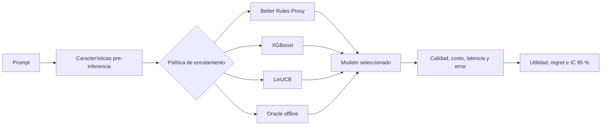
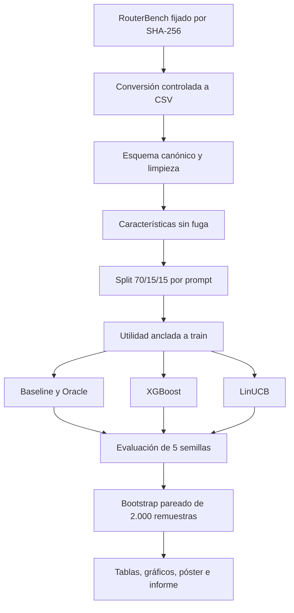
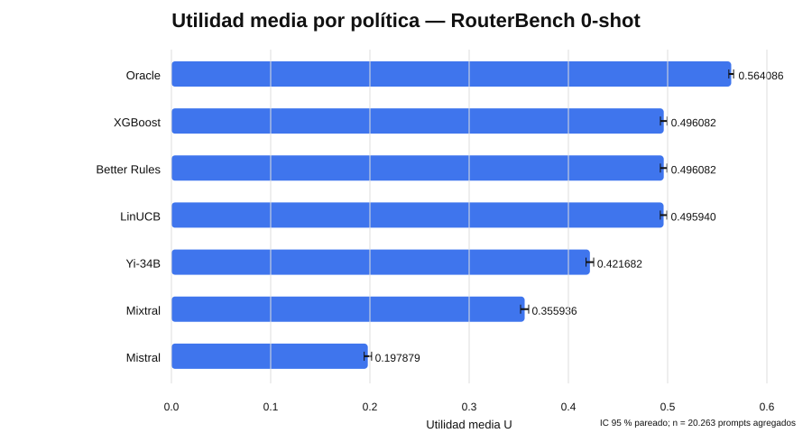
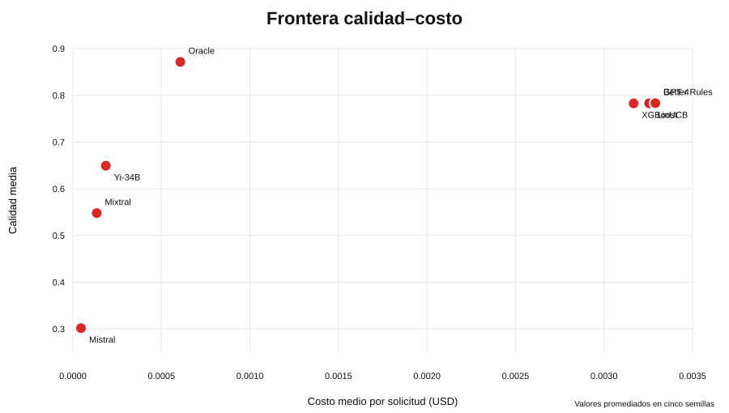
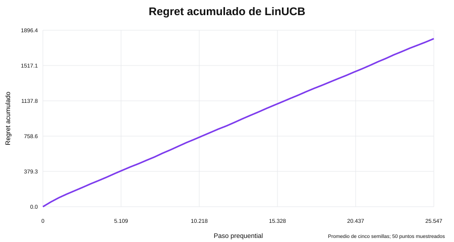

# Better Router Adaptive Research

[](https://github.com/FitoFritzG/better-router-adaptive-research/actions/workflows/ci.yml)
[](pyproject.toml)
[](LICENSE)
[](#resultados-reproducidos)

Investigación reproducible sobre **enrutamiento adaptativo de modelos de lenguaje**. El estudio evalúa si una política aprendida puede seleccionar, para cada consulta, el modelo que maximiza una utilidad conjunta de calidad, costo, latencia y confiabilidad.

## Integrantes

- **Rodolfo Fritz**
- **Benjamín Cerda**
- **Felipe Friz**

Universidad del Bío-Bío — Ingeniería Civil en Automatización.

## Estado científico

El experimento principal fue ejecutado sobre RouterBench 0-shot con **36.497 prompts**, cuatro brazos de modelo, cinco semillas y bootstrap pareado por `prompt_id`. La reproducción independiente de los artefactos entregados obtuvo coincidencia numérica exacta en `evaluation_summary.csv` y `evaluation_per_seed.csv`.

> **Conclusión principal:** con las características pre-inferencia actuales, XGBoost y LinUCB **no superan de manera estadísticamente significativa** a Better Rules Proxy. El Oracle offline sí obtiene una mejora de utilidad de aproximadamente `+0,068`, lo que demuestra que existe margen para un router por consulta, pero las señales usadas todavía no permiten capturarlo.

## Pregunta de investigación

> ¿Las políticas de enrutamiento aprendidas logran una utilidad esperada superior a una política ponderada determinista al seleccionar entre modelos heterogéneos?

## Arquitectura del estudio



## Flujo reproducible



## Algoritmos comparados

| Estrategia | Rol |
|---|---|
| Better Rules Proxy | Línea base determinista aprendida solo desde `train` |
| XGBoost | Regresor supervisado de utilidad, uno por brazo |
| LinUCB | Bandit contextual disjunto con replay prequential |
| Oracle offline | Cota superior no desplegable |
| Brazos fijos | Referencias que siempre eligen el mismo modelo |

La utilidad bloqueada es:

$$
U = 0.65Q - 0.20C_n - 0.10L_n - 0.05E
$$

- `Q`: calidad normalizada.
- `C_n`: costo normalizado con estadísticas calculadas solo en `train`.
- `L_n`: latencia normalizada.
- `E`: indicador de error.

**Limitación:** RouterBench no aporta latencia para el artefacto utilizado; el término de latencia queda deshabilitado en la ejecución real y no se renormalizan los pesos restantes.

## Dataset experimental

Se utilizan cuatro brazos seleccionados de manera exploratoria desde el artefacto RouterBench verificado:

| Brazo | Calidad media | Costo medio USD |
|---|---:|---:|
| `mistralai/mistral-7b-chat` | 0,306 | 0,000046 |
| `mistralai/mixtral-8x7b-chat` | 0,547 | 0,000135 |
| `zero-one-ai/Yi-34B-Chat` | 0,647 | 0,000186 |
| `gpt-4-1106-preview` | 0,781 | 0,003293 |

El dataset procesado contiene **145.988 filas**, exactamente cuatro resultados por prompt y ninguna clave `(prompt_id, model_id)` duplicada.

### Política de datos

El dataset alojado por RouterBench no declara una licencia explícita en su tarjeta. Por esta razón:

- el dataset original y sus tablas fila por fila **no se redistribuyen** en este repositorio público;
- se publican scripts, configuración, checksums, resultados agregados y figuras;
- cada reproducción debe descargar el artefacto desde su fuente oficial y revisar sus términos.

## Resultados reproducidos

| Política | Utilidad media | IC 95 % | Diferencia vs. baseline | IC 95 % de la diferencia |
|---|---:|---:|---:|---:|
| Oracle | 0,564086 | [0,561654; 0,566461] | +0,068004 | [0,065643; 0,070490] |
| XGBoost | 0,496082 | [0,492714; 0,499395] | +0,000000 | [-0,000548; 0,000576] |
| Better Rules Proxy | 0,496082 | [0,492652; 0,499294] | 0 | [0; 0] |
| GPT-4 fijo | 0,496082 | [0,492652; 0,499294] | 0 | [0; 0] |
| LinUCB | 0,495940 | [0,492590; 0,499221] | -0,000142 | [-0,000475; 0,000189] |
| Yi-34B fijo | 0,421682 | [0,417763; 0,425488] | -0,074400 | [-0,078318; -0,070398] |
| Mixtral fijo | 0,355936 | [0,351823; 0,359983] | -0,140146 | [-0,144500; -0,135763] |
| Mistral fijo | 0,197879 | [0,194216; 0,201709] | -0,298203 | [-0,303143; -0,293205] |

Resultados agregados versionados: [`artifacts/public/step7-real/`](artifacts/public/step7-real/).

### Comparación de políticas



### Frontera calidad-costo



### Regret de LinUCB



## Interpretación

1. Better Rules Proxy converge a seleccionar GPT-4 para todas las categorías bajo la función de utilidad usada.
2. XGBoost reproduce prácticamente esa misma decisión; su intervalo de diferencia cruza cero.
3. LinUCB obtiene una utilidad ligeramente menor, pero la diferencia tampoco es concluyente.
4. El Oracle mejora simultáneamente la utilidad y la relación calidad-costo, por lo que el problema de routing no es inútil: faltan señales contextuales más informativas.
5. La selección de brazos se realizó después de inspeccionar promedios globales de calidad y costo. Por ello, el estudio debe interpretarse como **exploratorio**, no como una evaluación confirmatoria preregistrada.

Análisis completo: [`docs/RESULTS.md`](docs/RESULTS.md).

## Instalación

```bash
python -m venv .venv
```

Linux/macOS:

```bash
source .venv/bin/activate
python -m pip install --upgrade pip
python -m pip install -e ".[dev]"
```

Windows PowerShell:

```powershell
.venv\Scripts\Activate.ps1
python -m pip install --upgrade pip
python -m pip install -e ".[dev]"
```

El proyecto fija `xgboost==3.3.0` porque esa versión reproduce los artefactos numéricos publicados.

## Reproducir la evaluación final

```bash
python -m better_router_adaptive.evaluate \
  --input data/processed/step3-real/routerbench_canonical_clean.csv.gz \
  --output-directory artifacts/runs/step7-real \
  --bootstrap-samples 2000 \
  --evidence-label "RouterBench 0-shot — datos reales"
```

Cada semilla se evalúa en un proceso independiente. Esto evita la acumulación de estado nativo de XGBoost/OpenMP durante los cinco entrenamientos completos.

## Verificación

```bash
python -m pytest -q \
  --cov=better_router_adaptive \
  --cov-branch \
  --cov-report=term-missing \
  --cov-fail-under=85
ruff check .
ruff format --check .
mypy src tests
python -m build
```

La CI ejecuta pruebas, cobertura, lint, formato, tipado estricto, build y smoke tests en Python 3.12 y 3.13.

## Documentación

- [Metodología](docs/METHODOLOGY.md)
- [Diccionario de datos](docs/DATA_DICTIONARY.md)
- [Características y particiones](docs/STEP_4_FEATURES_SPLITS.md)
- [Utilidad y baselines](docs/STEP_5_UTILITY_BASELINES.md)
- [Routers aprendidos](docs/STEP_6_LEARNED_ROUTERS.md)
- [Evaluación final](docs/STEP_7_EVALUATION.md)
- [Resultados y limitaciones](docs/RESULTS.md)
- [Revisión del aporte del equipo](docs/reviews/TEAMMATE_DELIVERY_REVIEW.md)
- [Generador reproducible del póster](paper/poster/build_poster.py)

## Estado del proyecto

- [x] Procedencia y adquisición verificable de RouterBench.
- [x] Conversión, esquema canónico y limpieza.
- [x] Características sin fuga y split por `prompt_id`.
- [x] Función de utilidad, baseline y Oracle.
- [x] XGBoost y LinUCB.
- [x] Evaluación multi-semilla y bootstrap pareado.
- [x] Resultados reproducidos independientemente.
- [x] README, documentación y generador del póster con los tres integrantes.
- [ ] Informe IEEE final actualizado con resultados y conclusiones definitivas.

## Licencias y privacidad

El código propio se publica bajo MIT. Los datasets y benchmarks de terceros conservan sus términos. No se almacenan prompts de producción, API keys, usuarios ni información privada de Better Router. Consulte [`LICENSES.md`](LICENSES.md).
