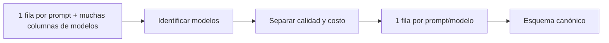

# Metodología de preparación de datos

## Objetivo

Transformar resultados heterogéneos de modelos en una tabla longitudinal reproducible para entrenar y evaluar políticas de enrutamiento.

## Fuente

La fuente principal propuesta es RouterBench 0-shot, fijada por revisión, tamaño y SHA-256 en el Paso 2. El código upstream representa el dataset en formato ancho: `sample_id`, `prompt`, `eval_name`, una columna de desempeño por modelo y columnas auxiliares `<modelo>|total_cost` y `<modelo>|model_response`.

## Conversión ancho → largo

Para cada modelo se crea una fila por prompt. La respuesta textual se descarta y se conservan calidad y costo. La categoría de tarea se deriva de `eval_name` mediante reglas declaradas y revisables.

## Limpieza

1. selección de las columnas canónicas;
2. eliminación de duplicados exactos;
3. rechazo de duplicados contradictorios;
4. normalización de textos y tipos;
5. exclusión de valores fuera de rango;
6. verificación de metadatos constantes por prompt;
7. eliminación completa de prompts sin los cuatro brazos requeridos;
8. orden determinista por `prompt_id` y `model_id`;
9. validación final del contrato.

No se corrigen valores objetivo de forma silenciosa.

## Reportes

Cada ejecución genera:

- conteos antes y después;
- duplicados eliminados;
- filas inválidas;
- filas retiradas por grupos incompletos;
- cantidad de prompts;
- manifiesto de esquema;
- figuras de distribución.

## Limitaciones

- La latencia puede estar ausente en RouterBench.
- El pickle requiere una carga controlada y no es un formato seguro.
- La clasificación de tareas se basa en el identificador del benchmark.
- La selección de cuatro brazos se definirá después de inspeccionar los modelos disponibles en el artefacto real.
